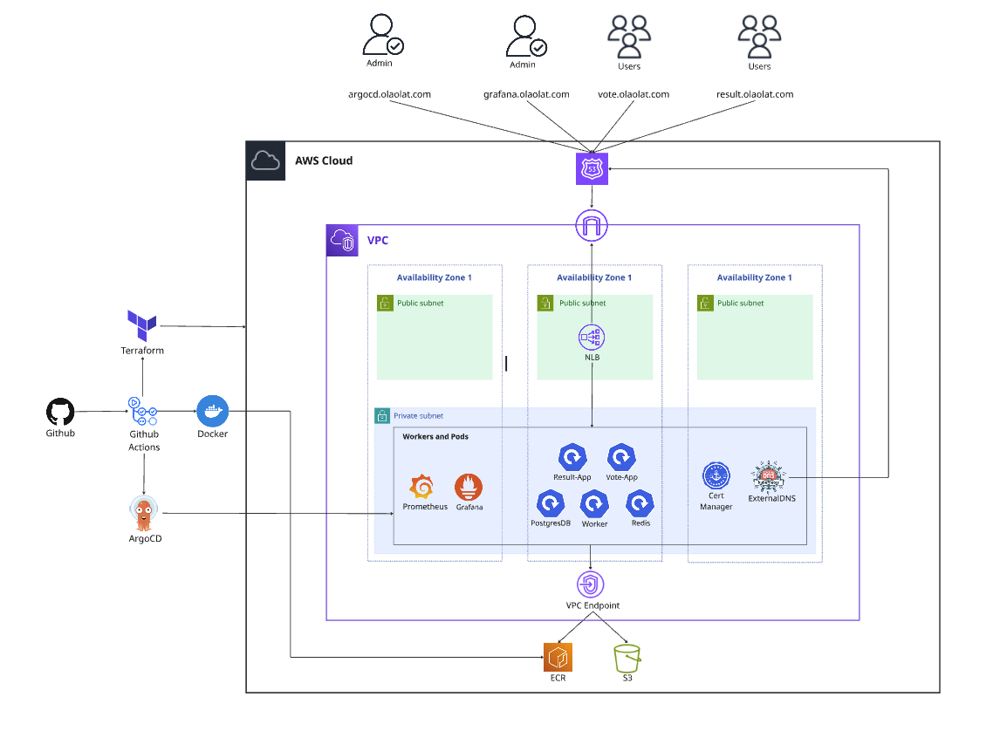
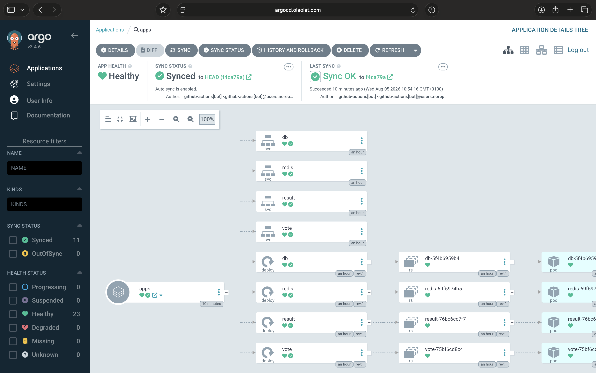
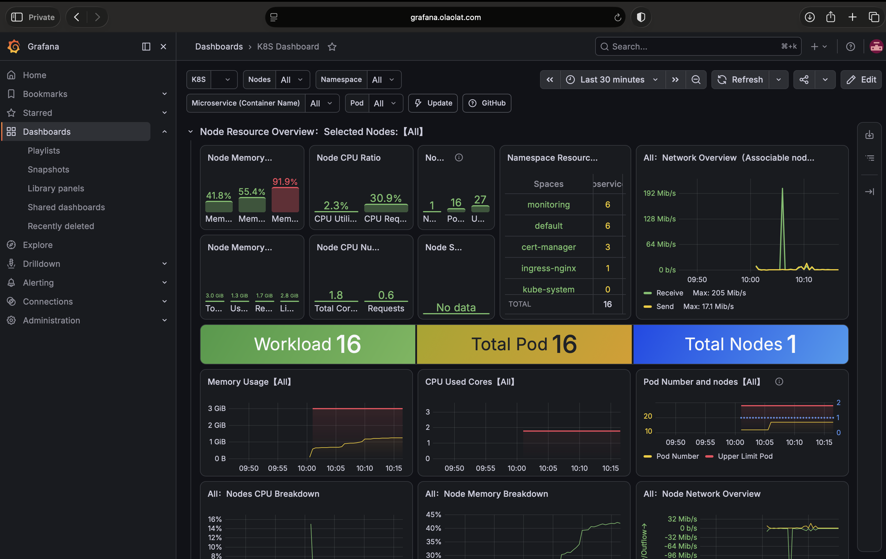

# EKS-Project

The Docker sample voting app running on **Amazon EKS in Auto Mode**, provisioned end-to-end with Terraform, published to ECR by GitHub Actions, and rolled out by Argo CD. TLS, DNS and monitoring are handled in-cluster by ingress-nginx, cert-manager, external-dns and kube-prometheus-stack. Single AWS account, single region (`eu-west-2`).

## Architecture



Traffic enters through a network load balancer fronting ingress-nginx, which terminates TLS using certificates cert-manager obtains from Let's Encrypt over a Route 53 DNS-01 solver. external-dns writes the matching records into the `olaolat.com` zone. Nodes are managed entirely by EKS Auto Mode and live only in private subnets; the load balancer lands in the public subnets by way of the `kubernetes.io/role/elb` subnet tags, not by an explicit subnet list.

| Hostname | Serves |
|---|---|
| `vote.olaolat.com` | Voting UI |
| `result.olaolat.com` | Live results (socket.io) |
| `argocd.olaolat.com` | Argo CD |
| `grafana.olaolat.com` | Grafana |

## Application

Five services in `voting-app/`, a fork of [dockersamples/example-voting-app](https://github.com/dockersamples/example-voting-app) with the worker rewritten in Java:

```
vote (Python/Flask) → redis → worker (Java 21) → postgres → result (Node 18 + socket.io)
```

Service discovery is by hostname hard-coded in the source — `redis` and `db`, with `postgres:postgres` credentials baked in — so any deployment has to keep those Service names. Three of the five are built here and pushed to ECR (`vote`, `result`, `worker`); `redis:alpine` and `postgres:15-alpine` come from Docker Hub.

### Run locally

```bash
cd voting-app
docker compose up                     # vote :8080, result :8081
docker compose --profile seed up -d   # optional: generate votes
```

### Build a single image

```bash
docker build -t voting-app/vote ./voting-app/vote
docker build -t voting-app/worker ./voting-app/worker   # multi-stage: maven build → shaded jar on a JRE base
```

## Infrastructure (Terraform)

Everything runs from `terraform/`. There is one environment and no workspaces — the root module composes three local modules and then installs the platform add-ons through the Helm and Kubernetes providers in the same apply.

```bash
cd terraform
terraform init
terraform fmt -recursive
terraform validate
terraform plan
terraform apply
tflint
trivy config .
```

State lives in S3 (`eks-project-tfstate-801497981564`) with **native S3 lockfile locking**, not DynamoDB — which is why `required_version >= 1.11.0`.

| Module | What it creates |
|---|---|
| `modules/vpc` | VPC `10.0.0.0/16`, three AZs, public + private `/20`s, a single shared NAT gateway, ELB role tags |
| `modules/eks` | Auto Mode cluster (`bootstrap_self_managed_addons = false`), API access entries, OIDC provider, Pod Identity associations and IAM for external-dns and cert-manager |
| `modules/ecr` | One repository per image — scan-on-push, AES256, lifecycle policy retaining `max_image_count` images |

Two root-level files sit alongside them:

- **`helm-charts.tf`** — ingress-nginx, external-dns, cert-manager, Argo CD and kube-prometheus-stack, each with values in `helm-values/`.
- **`kubernetes.tf`** — the default `gp3` StorageClass and the generated Grafana admin password. Auto Mode enables block storage but ships no StorageClass, so without this every PVC in the cluster sits `Pending`.

### Key outputs

`kubeconfig_command`, `cluster_endpoint`, `vpc_id`, `private_subnet_ids`, `public_subnet_ids`, `nat_gateway_public_ip`, `console_sign_in_url`.

### After the first apply

Terraform brings up the platform; two manifests bootstrap the app layer by hand:

```bash
aws eks update-kubeconfig --name example --region eu-west-2

kubectl apply -f voting-app/k8s-specifications/cluster-issuer.yaml   # before any Ingress needs a cert
kubectl apply -f voting-app/k8s-specifications/apps-argo.yaml        # hands the app to Argo CD

# Argo CD admin password
kubectl -n argocd get secret argocd-initial-admin-secret -o jsonpath='{.data.password}' | base64 -d

# Grafana admin password (generated by random_password, injected via set_sensitive)
kubectl -n monitoring get secret kube-prometheus-stack-grafana -o jsonpath='{.data.admin-password}' | base64 -d
```

## GitOps



`apps-argo.yaml` registers a single Argo CD Application watching `voting-app/k8s-specifications/app` on `main`, with `prune` and `selfHeal` enabled. Nothing is deployed with `kubectl apply` after bootstrap — the manifests in that path are the source of truth, and a commit to them is the deploy.

## Observability



kube-prometheus-stack runs in the `monitoring` namespace with Prometheus (15d retention on a 20Gi gp3 volume), Alertmanager and Grafana. The control-plane exporters EKS doesn't expose — controller-manager, scheduler, etcd, kube-proxy — are disabled along with their alert rules, since on Auto Mode they would sit permanently `Down`. Monitor selectors are cleared, so any ServiceMonitor in the cluster is picked up regardless of release labels.

Prometheus has no Ingress and no authentication of its own. Reach it directly:

```bash
kubectl -n monitoring port-forward svc/prometheus-operated 9090
```

## CI/CD

All workflows authenticate to AWS via OIDC into `role/github-actions` — no long-lived credentials.

| Workflow | Trigger | What it does |
|---|---|---|
| `vote-image-push.yaml` | PR / push on `voting-app/vote/**` | Docker build; on `main`, resolve the next version from ECR tags, push, bump the manifest |
| `result-image-push.yaml` | PR / push on `voting-app/result/**` | Same pipeline for the result service |
| `worker-image-push.yaml` | PR / push on `voting-app/worker/**` | Spotless, SpotBugs, JUnit + JaCoCo, Trivy filesystem audit, gitleaks, Docker build gated on a Trivy image scan, then push + manifest bump |
| `terraform-plan.yaml`, `terraform-appy.yaml`, `terraform-destroy.yaml` | — | **Empty placeholder files.** Terraform currently runs locally |

Versioning has no file in the repo acting as a counter: each pipeline reads the highest `vN.0.0` tag already in its ECR repository and publishes `N+1`, so the three services version independently and a PR run never consumes a number. Each image is pushed three times — `vN.0.0`, the commit SHA, and `latest`.

The last step is `scripts/update-manifest.sh`, which clones the repo, rewrites the `image:` line in the matching deployment manifest and commits it back. That commit is what Argo CD sees, so **the push to ECR does not deploy anything — the manifest bump does.** It runs only after a successful push, so a manifest can never point at a tag that isn't in the registry.

## Repository layout

```
terraform/                 Root module, backend, providers
  modules/                 vpc, eks, ecr
  helm-values/             Values for the five Helm releases
  helm-charts.tf           Platform add-ons
  kubernetes.tf            gp3 StorageClass, Grafana password
voting-app/                Forked voting app (vote, result, worker, healthchecks, seed-data)
  k8s-specifications/app/  Manifests Argo CD syncs — the deploy target
  k8s-specifications/      cluster-issuer.yaml, apps-argo.yaml (applied once, by hand)
.github/workflows/         Per-service image build/scan/push pipelines
scripts/update-manifest.sh Image tag bump committed back to the repo
images/                    Diagrams and screenshots
```

<!-- ## Known rough edges

- **The ClusterIssuer named `letsencrypt-prod` points at the ACME *staging* directory.** Certificates issue and renew, but browsers won't trust them until the `server:` URL is switched to `acme-v02.api.letsencrypt.org`.
- **First apply on a fresh cluster can fail on the gp3 StorageClass** with `storageclasses.storage.k8s.io is forbidden`. The EKS access entry granting `AmazonEKSClusterAdminPolicy` hasn't propagated into RBAC by the time Terraform makes its first Kubernetes call. Re-running `terraform apply` clears it.
- **The `monitoring` namespace is created by `create_namespace` on the Helm release**, so it isn't tracked in state and survives `terraform destroy` as an orphan.
- **Trivy image scanning is commented out** in the vote and result pipelines; only the worker build is gated on it. -->
